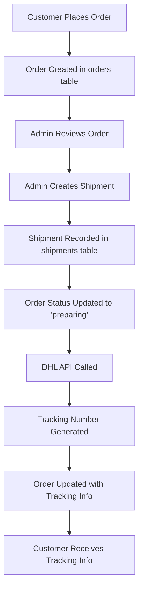

# Database Integration Guide

## 🔗 **How Shipping Integrates with Your Existing Database**

Your existing database schema works perfectly with the shipping system! Here's how everything connects:

## 📊 **Database Schema Integration**

### **1. Existing Tables Used**

#### **Orders Table** (Your existing table)
```sql
-- Your orders table already has these shipping fields:
shipping_status VARCHAR -- 'pending', 'preparing', 'shipped', 'delivered', 'returned'
shipping_address TEXT   -- Customer's shipping address
```

#### **Order Items Table** (Your existing table)
```sql
-- Used to calculate package weight and dimensions
product_id INTEGER
quantity INTEGER
price NUMERIC
total NUMERIC
```

#### **Products Table** (Your existing table)
```sql
-- Used for weight and dimension calculations
weight NUMERIC
dimensions JSONB
```

### **2. New Tables Added**

#### **Shipping Settings Table**
```sql
-- Stores DHL (and future providers) configuration
shipping_settings (
  id, provider, api_username, api_password, account_number,
  shipper_name, contact_person, phone, email, address1, city,
  postal_code, country_code, default_service, label_format,
  weight_unit, dimension_unit, insurance, signature_required,
  cod, allowed_countries, handling_fee, free_shipping_threshold
)
```

#### **Shipments Table**
```sql
-- Tracks individual shipments for each order
shipments (
  id, order_id, tracking_number, provider, service, status,
  price, currency, label_url, tracking_url, estimated_delivery,
  weight, dimensions, insurance, signature_required, cod
)
```

#### **Shipment Events Table**
```sql
-- Tracks shipment status changes and events
shipment_events (
  id, shipment_id, event_type, status, description,
  location, timestamp
)
```

#### **Shipping Zones Table**
```sql
-- Defines shipping regions and rules
shipping_zones (
  id, name, description, countries, is_active
)
```

#### **Shipping Rates Table**
```sql
-- Custom rate overrides per zone/provider
shipping_rates (
  id, zone_id, provider, service, min_weight, max_weight,
  base_price, per_kg_price, handling_fee, free_shipping_threshold
)
```

## 🔄 **Data Flow Integration**

### **1. Order Processing Flow**



### **2. Shipping Address Integration**

Your `orders.shipping_address` field can store either:
- **JSON format** (recommended):
```json
{
  "name": "John Doe",
  "company": "Acme Corp",
  "address1": "123 Main St",
  "address2": "Apt 4B",
  "city": "New York",
  "postalCode": "10001",
  "countryCode": "US",
  "phone": "+1234567890",
  "email": "john@example.com"
}
```

- **Plain text** (fallback):
```
John Doe
123 Main St, Apt 4B
New York, NY 10001
```

### **3. Weight Calculation Integration**

The system automatically calculates shipping weight from your existing data:

```typescript
// From your order_items and products tables
const totalWeight = orderItems.reduce((sum, item) => {
  const product = products.find(p => p.id === item.product_id);
  const itemWeight = product?.weight || 1.0; // Default weight
  return sum + (itemWeight * item.quantity);
}, 0);
```

## 🛠️ **API Integration Examples**

### **1. Create Shipment for Existing Order**

```typescript
// POST /api/shipping/orders/{orderId}/shipments
const response = await fetch(`/api/shipping/orders/${orderId}/shipments`, {
  method: 'POST',
  headers: { 'Content-Type': 'application/json' },
  body: JSON.stringify({
    provider: 'dhl',
    service: 'EXPRESS'
  })
});

// This will:
// 1. Fetch order details from your orders table
// 2. Get order items from order_items table
// 3. Calculate weight from products table
// 4. Create shipment via DHL API
// 5. Store shipment in shipments table
// 6. Update order status in orders table
```

### **2. Track Shipment**

```typescript
// GET /api/shipping/tracking?trackingNumber=TRACK123
const tracking = await fetch('/api/shipping/tracking?trackingNumber=TRACK123');
// Returns tracking events from shipment_events table
```

### **3. Get Order Shipping Status**

```typescript
// Your existing orders query now includes shipping info
const order = await supabase
  .from('orders')
  .select(`
    *,
    shipments (
      tracking_number,
      status,
      provider,
      service,
      price,
      estimated_delivery
    )
  `)
  .eq('id', orderId)
  .single();
```

## 📱 **Admin Dashboard Integration**

### **1. Orders Management**
Your existing orders page can now include:
- Shipping status badges
- Tracking number display
- Create shipment buttons
- Shipping cost information

### **2. New Shipping Settings Page**
- Accessible at `/admin/settings/shipping`
- Configure DHL and future providers
- Manage shipping zones and rates
- Test API connections

### **3. Order Details Enhancement**
Each order can now show:
- Complete shipping history
- Tracking information
- Label downloads
- Status updates

## 🔧 **Migration Steps**

### **1. Run the Migration**
```bash
# Run the shipping integration migration
psql -d your_database -f migrations/2025-01-20-shipping-integration.sql
```

### **2. Configure DHL Settings**
1. Go to `/admin/settings/shipping`
2. Enter your DHL API credentials
3. Configure shipper information
4. Test the connection

### **3. Update Existing Orders (Optional)**
```sql
-- Convert existing shipping_address to JSON format
UPDATE orders 
SET shipping_address = json_build_object(
  'name', customer,
  'address1', shipping_address,
  'city', '',
  'postalCode', '',
  'countryCode', 'US'
)::text
WHERE shipping_address NOT LIKE '{%';
```

## 🎯 **Key Benefits**

### **1. Seamless Integration**
- Uses your existing order structure
- No breaking changes to current functionality
- Backward compatible with existing data

### **2. Enhanced Order Management**
- Real-time shipping status updates
- Automatic tracking number generation
- Integrated shipping cost calculation

### **3. Scalable Architecture**
- Easy to add new shipping providers
- Flexible shipping zone management
- Custom rate overrides per region

### **4. Complete Audit Trail**
- Every shipment tracked in database
- Status change history
- Event logging for compliance

## 🚀 **Ready-to-Use Features**

### **1. Automatic Status Updates**
When a shipment status changes, your order status automatically updates:
- `preparing` → Order status: "Processing"
- `shipped` → Order status: "Shipped" 
- `delivered` → Order status: "Completed"

### **2. Weight-Based Pricing**
Automatically calculates shipping costs based on:
- Product weights from your products table
- Order quantities from order_items table
- DHL's weight-based pricing

### **3. Multi-Provider Support**
Ready to add:
- FedEx
- Aramex
- UPS
- Any other shipping provider

### **4. Regional Shipping**
- Configure different rates per country
- Free shipping thresholds
- Handling fees per region

## 🔒 **Security & Compliance**

### **1. Data Protection**
- API credentials encrypted in database
- RLS policies on all shipping tables
- Secure API communication

### **2. Audit Trail**
- Complete shipment history
- Status change tracking
- Event logging for compliance

### **3. Error Handling**
- Graceful API failure handling
- Fallback shipping options
- Clear error messages

## 📈 **Performance Optimizations**

### **1. Database Indexes**
- Optimized queries for order lookups
- Fast tracking number searches
- Efficient status filtering

### **2. Caching**
- Rate calculation caching
- Provider configuration caching
- Reduced API calls

### **3. Async Processing**
- Non-blocking shipment creation
- Background status updates
- Webhook processing

---

**Your existing database structure is perfectly compatible with the shipping system! The integration is designed to enhance your current functionality without breaking anything.** 🎉
